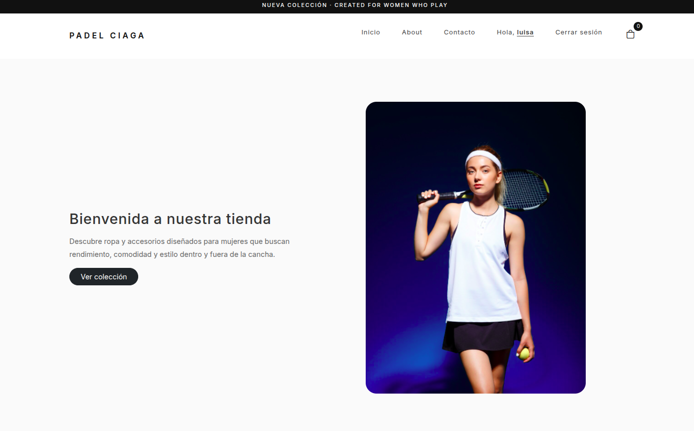

# **PADEL CIAGA 🎾 🙋‍♀️**

---

## **Sobre PADEL CIAGA 🛒**

En un mundo dónde las mujeres se atreven más a hacer deporte , ya sea para adquirir fuerza , movimiento , tranquilizar tu mente . botar el estrés o simplemente por que te gusta . Sabemos que tener un espacio para poder obtener tu ropa deportiva explusivamente para tu deporte favorito de muchas , **El Pádel** , te invitamos a descubrir nuestros conjuntos y accesorios para que puedas jugar cómodamente y con estilo.
_¿Genial no?_.



---

## **Sobre el proyecto💡**

En este proyecto pretendemos crear un catálogo de productos , en dónde el usuario puede escoger el producto , la cantidad , ver el carrito de compras y similar la compra . Usamos un login y previamente un registro , para poder guardar sus datos en la página .


---

### **Proceso de Diseño🎨**

Queremos dirigir este producto a quien se identifique con la feminidad y practique Pádel , el diseño es minimalista , además de inspirarse en páginas de productos deportivos.

Decir que para las imágenes 📸 del proyecto se usó el banco de imágenes *https://www.magnific.com/es*

---

### **Despliegue**

El proyecto se encuentra desplegado en **Render**.

> Nota: Al estar alojado en un servicio gratuito, el servidor puede entrar en modo inactivo. Si al ingresar la página no carga la data a la primera, espera unos segundos y vuelve a intentarlo para activar nuevamente el servidor.

## Link :

*https://padelciaga.onrender.com/*

---

### ✨ Funcionalidades principales ✨

#### **Catálogo de productos 🛍️**

- Visualización dinámica de productos.
- Información de nombre, precio, imagen y disponibilidad.
- Organización de productos mediante vistas renderizadas con Handlebars.

#### Carrito de compras 🛒

- Agregar productos al carrito.
- Aumentar o disminuir cantidades.
- Eliminar productos.
- Cálculo automático del total.
- Persistencia del carrito mediante `localStorage`.
- Validación para evitar continuar al checkout con un carrito vacío.

#### Usuarios y autenticación 👤

- Registro de nuevos usuarios.
- Contraseñas almacenadas mediante hashing con `bcrypt`.
- Inicio de sesión mediante sesiones.
- Protección de rutas que requieren autenticación.
- Redirección al login cuando un usuario intenta acceder al checkout sin estar autenticado.

#### Perfil de usuario 📝

- Visualización y edición de información personal.
- Datos del usuario almacenados y consultados desde PostgreSQL.
- Actualización de información como nombre, apellido, email, teléfono y dirección.

#### Checkout y pedidos 📦

- Acceso al checkout para usuarios autenticados.
- Prellenado de información del usuario.
- Resumen de productos y cantidades antes de realizar el pedido.
- Cálculo del total de la compra.
- Creación y persistencia de pedidos en PostgreSQL.
- Registro de los productos incluidos en cada pedido.
- Generación de un número de pedido.
- Página de confirmación después de completar la compra.
- Limpieza automática del carrito después de crear correctamente el pedido.

#### Persistencia de datos 🗄️

La información principal de usuarios y pedidos se almacena en PostgreSQL mediante las tablas:

- `users`
- `orders`
- `order_items`

Los pedidos mantienen además un registro del precio de cada producto en el momento de la compra.

---

## Flujo de compra

```text
Catálogo
   ↓
Producto
   ↓
Carrito
   ↓
Login / Registro
   ↓
Checkout
   ↓
Creación del pedido
   ↓
PostgreSQL
   ↓
Confirmación del pedido
```

---

### **Recursos y Tecnologías**

🟣 **Frontend:** maquetación con HTML5, estilos y diseño responsive con CSS3 y Bootstrap, funcionalidad e interactividad con JavaScript y renderizado dinámico con Handlebars.
🟣 **Backend:** desarrollo del servidor y manejo de rutas con Node.js y Express.js.
🟣 **Base de datos:** persistencia de usuarios y pedidos con PostgreSQL.
🟣 **Deploy y control de versiones:** Render, Git y GitHub.

---

Si llegaste Hasta aquí **¡ gracias ! ❤️** , estamos trabajando para usted , haciendo una **versión 2.0** para poder integrar simulación de pago y puedas ver la orden de compra en tu perfil , _si no me crees , mira los commits !_
